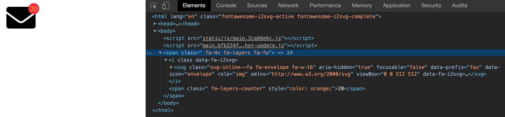

<h1 align="center">Font Awesome 5 for SpringType</h2>

> Vector icons and social logos from fontawesome.com

<h2 align="center">Setup</h2>

    yarn add st-font-awesome

<h2 align="center">Use</h2>

Include the CSS from a CDN or locally:

```html
<head>

  <!-- add Font Awesome icon support -->
  <link rel="stylesheet" href="https://cdnjs.cloudflare.com/ajax/libs/font-awesome/5.11.2/css/all.min.css" />

  <!-- in case of the need of advanced features like Power Transforms, include the JS library as well -->
  <script src="https://use.fontawesome.com/releases/v5.11.2/js/all.js" data-auto-replace-svg="nest"></script>

</head>
```

Use the `<FA icon="${name}" />` SpringType component:

```ts
import { st } from 'springtype';
import { FA } from 'st-font-awesome';

st.render(<FA icon="plus" />);
```

<h2 align="center">API</h2>

There is full support for all Font Awesome features including Sizing, Fixed-Width, Icons in a List, Rotation, Animation, Borders, Pulled Icons, Stacking, Power Transforms, Masking, Layering, Texts, Counters and Duotone Icons:

The following components are implemented:

- [x] `FA`
- [x] `FALayers`
- [x] `FALayersCounter`
- [x] `FALayersText`
- [x] `FALayers`
- [x] `FAStack` (legacy stacking support, use layers)

Options available:

```ts
// for <FA icon="plus" ... />
interface IFAAttrs {
    icon?: IconName;
    duotone?: boolean;
    swapOpacity?: boolean;
    rotate90?: boolean;
    rotate180?: boolean;
    rotate270?: boolean;
    flipHorizontal?: boolean;
    flipVertical?: boolean;
    flipBoth?: boolean;
    animateSpin?: boolean;
    animatePulse?: boolean;
    pullRight?: boolean;
    pullLeft?: boolean;
    border?: boolean;
    inverse?: boolean;
    stack?: StackSizes;
}
```

For example, layering and stacking like this:

```ts
import { st } from 'springtype/core';
import { tsx } from 'springtype/web/vdom';
import { FA, FALayers, FALayersCounter } from 'st-font-awesome';

st.render(
    <FALayers size="4x">
        <FA icon="envelope" />
        <FALayersCounter color="orange">20</FALayersCounter>
    </FALayers>
);
```

...results in: 



<h2 align="center">Maintainers</h2>

<table>
  <tbody>
    <tr>
      <td align="center">
        
        </br>
        <a href="https://github.com/kyr0">Aron Homberg</a>
      </td>
      <td align="center">
        
        </br>
        <a href="https://github.com/mansi1">Michael Mannseicher</a>
      </td>
    </tr>
  <tbody>
</table>

<h2 align="center">Contributing</h2>

Please help out to make this project even better and see your name added to the list of our  
[CONTRIBUTORS.md](./CONTRIBUTORS.md) :tada: